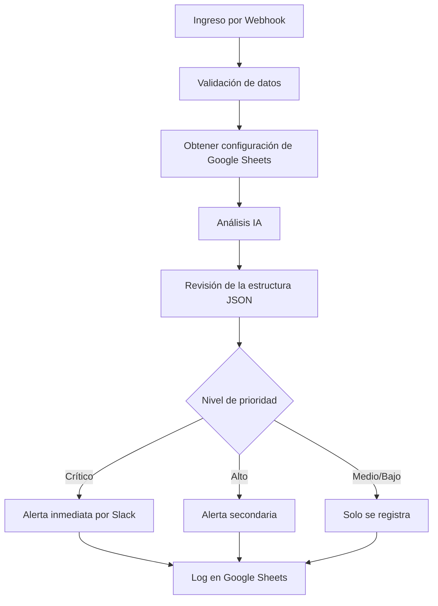
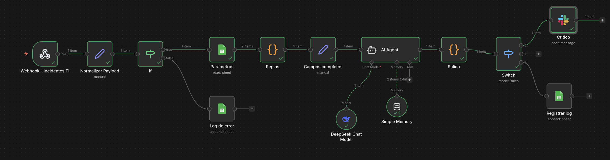

# Orquestador Inteligente de Incidentes de TI (n8n + IA)

## 1. Resumen Técnico

Este proyecto implementa un Orquestador de Incidentes de TI basado en IA, utilizando n8n como motor de automatización.

Centraliza la recepción de incidentes multicanal a través de un punto webhook y aplica el análisis de un modelo de IA (LLM) para determinar:

- Gravedad Técnica
- Impacto en el Negocio
- Urgencia
- Puntuación de Prioridad Final
- Justificación legible

El flujo de trabajo enruta las notificaciones dinámicamente y registra datos estructurados para la mejora continua y la medición más adelante.

---

## 2. Diseño de la arquitectura

### Componentes principales

- n8n (Autoalojado o en la nube)
- Nodo webhook (Punto final de entrada unificado)
- LLM (OpenAI / Gemini / DeepSeek u otro modelo de IA)
- Hojas de cálculo de Google (Configuración + Registro)
- API de Slack (Notificaciones críticas)
- Nodos de enrutador y conmutador (Lógica de prioridad)
- Análisis de JSON y normalización de datos

---

## 3. Flujo del sistema

1. El webhook recibe la información en formato JSON
2. Validación y normalización de entrada
3. Obtener parámetros de configuración de Hojas de cálculo de Google:
- Sistemas críticos
- Horarios sensibles
- Palabras clave/dominios de rutina
- Definición de roles para el comportamiento de LLM
4. Análisis de IA (LLM) (salida JSON estructurada)
5. Lógica de enrutamiento prioritario
6. Notificación condicional
7. Registro estructurado
8. Almacenamiento preparado para métricas

---

## 4. Arquitectura de Mermaid Diagrama



---

## 5. Ejemplo de carga de datos al webhook

Se puede invocar de varias maneras: 

1. Por medio de una aplicación que envíe los datos al webhook:

curl -X POST <DIRECCION_WEB_DEL_WEBHOOK> -H "Content-Type: application/json" -d '{ "origen": "app_interna", "usuario": "Eduardo Gonzales", "titulo": "Servicio caido", "descripcion": "Los sistemas no están funcionando correctamente", "sistemas": "todos", "tipo_evento": "Evento", "timestamp": "2026-02-09T12:17:00" }'

2. Por medio de un GPT de OpenAI

Crear el GPT en la plataforma de ChatGPT e indicarle los datos que se enviarán al webhook y la direción http. Este GPT se deberá crear con una acción que invoque al webhook mediante OpenAPI. Una vez creado el GPT, podrán iniciar una conversación que al final enviará los datos al flujo automatizado.

3. Por medio de un formulario de Google Form

Se puede integrar googleform con el webhook por medio de Apps Script (el código está presente en el repositorio). Configurando la acción para que invoque la función con el botón submit.


---

## 6. Estrategia de ingeniería de avisos LLM

### Asignación dinámica de roles

El rol LLM se puede configurar desde Hojas de Cálculo de Google:

Ejemplo:
"Usted es un gerente sénior de operaciones de TI, responsable del cumplimiento del SLA y la continuidad del negocio."

### Aplicación de Respuesta Estructurada

El LLM está obligado a devolver JSON estricto:

```json
{
"severidad": "Alta",
"impacto_negocio": "Crítico",
"urgencia": "Inmediata",
"prioridad_final": "Crítico",
"justificacion_clara": "Interrupción de producción del ERP que afecta los ingresos."
}
```

La validación de JSON se aplica antes del enrutamiento.


---

## 8. Estructura de registro

Los campos que se pueden registrar:

- Marca de tiempo
- Remitente/Usuario
- Título del incidente
- Descripción
- Sistemas afectados
- Gravedad
- Impacto en el negocio
- Urgencia
- Prioridad final
- Justificación de IA

Esto permite:

- Seguimiento del cumplimiento del SLA
- Detección de recurrencia de incidentes
- Optimización de avisos
- Cálculo del tiempo medio de recuperación (MTTR)


## 9. Métricas de impacto en el negocio

Posibles KPI:

- Tiempo medio de respuesta (MTTR)
- % de cumplimiento del SLA
- Tasa de detección de incidentes críticos
- Tasa de incidentes recurrentes
- Carga de incidentes por equipo

---

## 10. Roles técnicos objetivo

Este proyecto demuestra competencias alineadas con:

- Liderazgo de operaciones de TI
- Arquitectura de soluciones
- Ingeniería de automatización
- Estrategia de integración de IA
- Transformación digital

---

## 11. Conclusión

Se trata de un flujo de trabajo operativo mejorado con IA que combina:

- Arquitectura basada en eventos
- Ingeniería de avisos
- Automatización de decisiones
- Registro estructurado
- Diseño orientado a KPI

Demuestra la capacidad de diseñar sistemas de automatización inteligentes, escalables y alineados con el negocio.

---

## Captura del Flujo (n8n)

